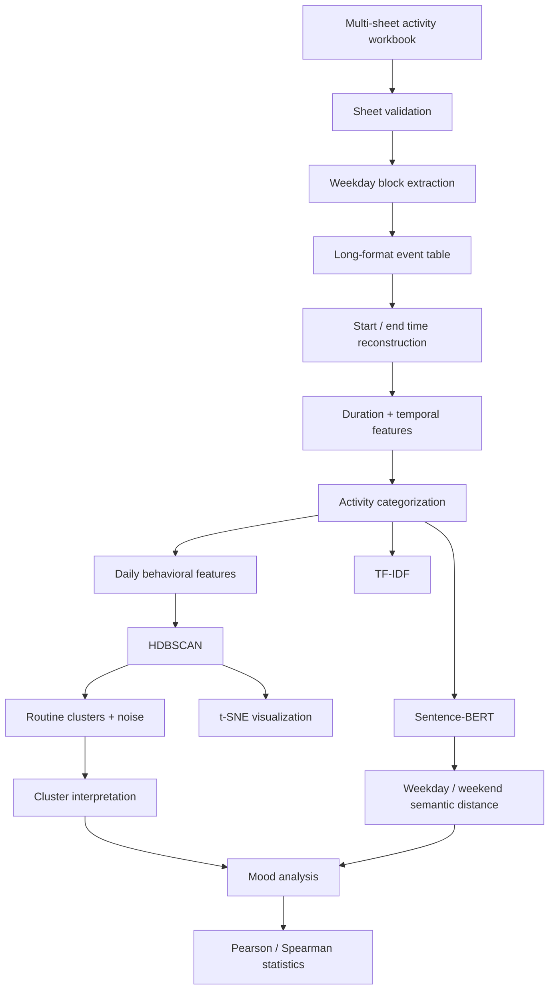

# Student Routines & Mood Clustering

> Behavioral analytics and unsupervised-learning project for converting semi-structured student activity diaries into event-level routine data and studying relationships with self-reported mood.

[](https://perpsakach.github.io/)


## Overview

The project begins with a data-engineering problem rather than a clean ML-ready table. Student activity diaries were organized across many Excel worksheets and repeated weekday blocks, requiring event reconstruction before clustering or statistical analysis was meaningful.

The analysis combines:

- workbook parsing and normalization;
- activity-duration reconstruction;
- behavioral feature engineering;
- traditional NLP with TF-IDF;
- semantic embeddings with Sentence-BERT;
- HDBSCAN clustering;
- t-SNE visualization;
- Pearson and Spearman association analysis.

## Architecture



## Data-engineering stage

Recovered workbook logic included:

- participant sheets matching patterns such as `A_*`, `B_*`, and `C_*`;
- repeated Monday–Sunday column blocks;
- forward-filling visually continued activities/context;
- inferring each event's end time from the next event's start time;
- assigning the final daily activity a 30-minute terminal duration;
- collapsing consecutive identical activity/context rows;
- near-duplicate routine comparison using `SequenceMatcher` with an 85% threshold in one historical workflow.

## NLP representation

### TF-IDF

Provides interpretable lexical information about characteristic activity words and n-grams.

### Sentence-BERT

Recovered model:

```python
SentenceTransformer("all-MiniLM-L6-v2")
```

SBERT captures semantic similarity between differently worded activities such as:

```text
go to gym
work out
exercise
strength training
```

## Why HDBSCAN?

HDBSCAN was appropriate because:

- the number of routine types was not known in advance;
- behavioral clusters may have irregular shapes and densities;
- some observations may legitimately not belong to any stable cluster;
- noise can be represented explicitly with cluster label `-1`.

Mood is best treated as an interpretation variable after behavioral clustering rather than automatically included in the cluster feature space, which avoids circular conclusions.

## Weekday vs weekend semantic analysis

For each student, weekday and weekend activity text can be embedded separately and compared with cosine distance:

```text
Semantic distance = 1 - cosine similarity(weekday, weekend)
```

That value can then be compared with the change in self-reported mood to study whether larger routine changes are associated with mood changes.

## Repository structure

```text
src/
├── workbook_parser.py
├── categorization.py
├── sequence_dedup.py
├── features.py
├── semantic.py
├── clustering.py
├── analysis.py
└── visualization.py

tests/
notebooks/
docs/
sample_data/
```

## Run

```bash
pip install -r requirements.txt
python run_pipeline.py --workbook csit552_data.xlsx --output-dir outputs
```

The authentic source workbook is intentionally not published in this repository.

## Methodological limitations

- activity and mood data are observational and self-reported;
- association does not establish causation;
- repeated observations from the same participant are not statistically independent;
- t-SNE is a visualization technique, not the clustering algorithm;
- exact historical HDBSCAN hyperparameters and final cluster counts are not claimed without source evidence.

## Provenance

- **RECOVERED** — historical workbook structure, feature-engineering logic, SBERT/HDBSCAN/t-SNE/TF-IDF methodology
- **RECONSTRUCTED** — current modular implementation
- **ENHANCED** — diagnostics, tests, structured configuration, and validation
- **UNVERIFIED** — exact historical cluster counts/hyperparameters and unrecovered result values

See [`PROVENANCE.md`](PROVENANCE.md).

## Portfolio

Explore the complete technical portfolio at **[perpsakach.github.io](https://perpsakach.github.io/)**.