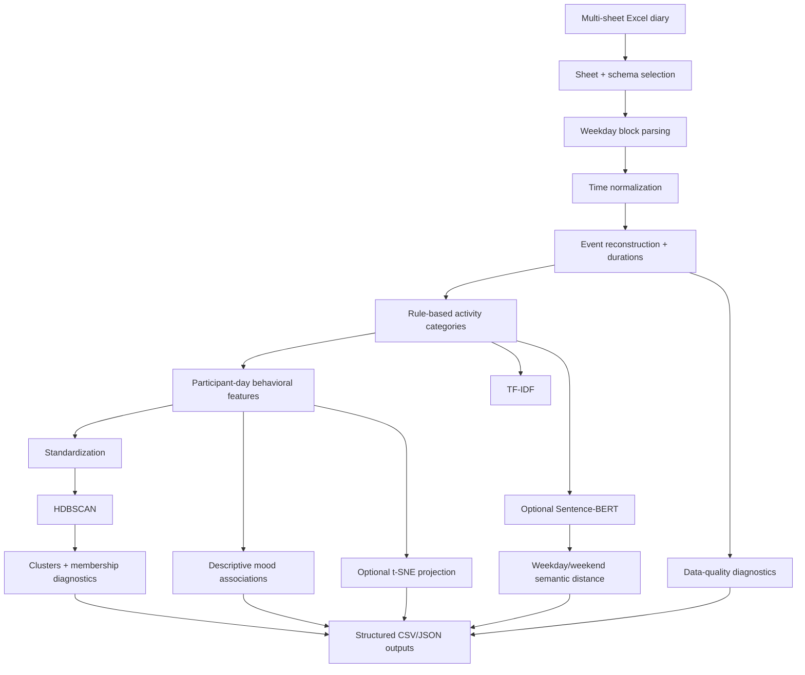

# Student Routines & Mood Clustering

> Behavioral analytics and unsupervised-learning pipeline for reconstructing event-level student routines from semi-structured activity diaries, engineering participant-day behavioral features, clustering routine patterns, and describing associations with self-reported satisfaction/mood.

[](https://github.com/PerpsAkach/student-routines-mood-clustering/actions/workflows/ci.yml)
[](https://perpsakach.github.io/)


## Overview

The central engineering problem is not simply clustering. The recovered project began with a semi-structured Excel diary format containing repeated weekday activity blocks across many participant worksheets. Meaningful analysis therefore requires a reproducible transformation from workbook cells into ordered events before any NLP, clustering, or statistical interpretation is possible.

The public implementation now provides an auditable pipeline for:

- validating and parsing participant worksheets;
- normalizing Excel/time representations;
- reconstructing event start/end times and durations;
- categorizing activity text with transparent rules;
- building participant-day behavioral features;
- clustering behavioral patterns with HDBSCAN;
- generating cluster diagnostics rather than reporting labels without context;
- producing TF-IDF representations;
- optionally computing Sentence-BERT weekday/weekend semantic distance;
- optionally creating a t-SNE visualization;
- summarizing satisfaction/mood by activity category;
- computing descriptive Pearson and Spearman feature/mood associations;
- exporting data-quality diagnostics and a machine-readable run manifest.

The authentic historical diary workbook is **not published** in this repository.

Detailed contracts and boundaries: [`IMPLEMENTATION_STATUS.md`](IMPLEMENTATION_STATUS.md) · [`docs/INPUT_CONTRACT.md`](docs/INPUT_CONTRACT.md) · [`docs/OUTPUT_CONTRACT.md`](docs/OUTPUT_CONTRACT.md) · [`PROVENANCE.md`](PROVENANCE.md)

## Architecture



## Workbook reconstruction

The default parser selects sheets matching:

```text
^[ABC]_\d+$
```

and interprets repeated Monday–Sunday blocks as:

```text
Time | Activity | Who | Satisfaction
```

The public normalized schema includes a `Where` field for compatibility with recovered project context, but the reconstructed four-column source layout does not provide a distinct `Where` column. The implementation therefore leaves it missing instead of fabricating values.

Clock values can be read from Excel fractional-day numbers, Python/pandas time objects, or parseable strings. Within each participant/day, each event ends when the next event begins; the final event receives a configurable terminal duration that defaults to 30 minutes.

See [`docs/INPUT_CONTRACT.md`](docs/INPUT_CONTRACT.md) for the exact mapping.

## Activity categorization

The current public implementation uses transparent regular-expression rules for categories such as:

- Sleep
- Eating
- Exercise
- Academic
- Work
- Social
- Entertainment
- Screen Time
- Other

This is intentionally presented as a heuristic taxonomy, not as a validated behavioral ontology.

## Behavioral feature engineering

`build_daily_features` creates one row per participant/day. The feature set contains category-duration totals plus behavioral summary variables such as event count, total observed minutes, and a weekend indicator.

A key methodological safeguard is that **daily mean mood is not included in the HDBSCAN feature space**. Mood remains available for post-clustering interpretation. That avoids constructing clusters with the same variable later used to describe them.

## Why HDBSCAN?

HDBSCAN is suitable for this reconstructed problem because:

- the number of routine types is not known in advance;
- behavioral groupings can have uneven density;
- some participant-days may not belong to a stable cluster;
- label `-1` explicitly represents HDBSCAN noise/outlier assignments.

Before fitting, numeric behavioral features are cleaned, zero-variance columns are removed, and remaining features are standardized. The pipeline refuses contradictory configuration and skips clustering explicitly when there are too few participant-days for the configured minimum cluster size.

The output includes cluster membership strength and run-level diagnostics for substantive cluster count, noise fraction, and mean assignment probability.

## Text representation

### TF-IDF

The repository supports lowercase English unigram/bigram TF-IDF for interpretable lexical representation of activity descriptions.

### Sentence-BERT

Recovered model context:

```python
SentenceTransformer("all-MiniLM-L6-v2")
```

The public runner makes Sentence-BERT analysis optional because first use may require downloading model assets. For each participant with both weekday and weekend activity text, the pipeline can compute:

```text
Semantic distance = 1 - cosine_similarity(weekday_embedding, weekend_embedding)
```

Embedding-model injection is supported so semantic helper behavior can be tested without network/model downloads.

## Routine-text similarity

Recovered project context included `SequenceMatcher`-based near-routine comparison around an 85% similarity threshold. The current repository exposes normalized text-similarity helpers while keeping this separate from HDBSCAN; textual sequence similarity and multivariate behavioral clustering answer different questions.

## Mood / satisfaction analysis

The pipeline writes descriptive activity-category mood summaries and participant-day feature/mood association tables using Pearson and Spearman statistics.

These results are **descriptive, not causal**. The diary observations are self-reported and repeated participant-days are not independent. The current public implementation does not fit a hierarchical, repeated-measures, mixed-effects, or causal model.

## t-SNE

`t-SNE` is available as an optional two-dimensional visualization layer with a fixed random seed. It is **not** the clustering algorithm and is not used as evidence that HDBSCAN clusters are valid.

## Data-quality reporting

Every real run produces diagnostics for:

- parsed events;
- unique participants;
- participant-days;
- repeated participant/day timestamps;
- zero-duration events;
- missing satisfaction values;
- missing activity values;
- invalid duration values.

The pipeline records skipped clustering/visualization states explicitly rather than silently manufacturing output.

## Run

Install the full runtime:

```bash
python -m pip install -r requirements.txt
```

Run the core offline pipeline against a compatible local workbook:

```bash
python run_pipeline.py \
  --workbook csit552_data.xlsx \
  --output-dir outputs
```

Add semantic comparison:

```bash
python run_pipeline.py \
  --workbook csit552_data.xlsx \
  --output-dir outputs \
  --semantic
```

Add t-SNE visualization:

```bash
python run_pipeline.py \
  --workbook csit552_data.xlsx \
  --output-dir outputs \
  --tsne
```

Both options can be used together.

## Outputs

Core outputs:

```text
events_clean.csv
daily_features.csv
daily_clusters.csv
mood_by_category.csv
mood_feature_correlations.csv
data_quality.json
clustering_diagnostics.json
run_manifest.json
```

Optional outputs:

```text
weekday_weekend_semantic_distance.csv
tsne_projection.csv
tsne_projection.png
```

See [`docs/OUTPUT_CONTRACT.md`](docs/OUTPUT_CONTRACT.md) for field-level interpretation rules.

## Tests and CI

GitHub Actions validates the repository on Python 3.11, 3.12, and 3.13. The workflow includes:

```text
Lean scientific test environment
        ↓
Source compilation
        ↓
Automated tests
        ↓
CLI surface validation

Ruff linting               → separate quality gate
pip-audit                  → separate dependency-security gate
Full runtime installation  → separate import-compatibility gate
```

The lean test jobs intentionally avoid downloading Sentence-BERT/PyTorch model assets. The production dependency stack is still installed and imported in a dedicated compatibility job.

## Repository structure

```text
.github/workflows/
└── ci.yml

docs/
├── INPUT_CONTRACT.md
└── OUTPUT_CONTRACT.md

src/
├── analysis.py
├── categorization.py
├── clustering.py
├── config.py
├── features.py
├── quality.py
├── routine_similarity.py
├── semantic.py
├── visualization.py
└── workbook_parser.py

tests/
├── test_analysis.py
├── test_categorization.py
├── test_config.py
├── test_features.py
└── test_workbook_parser.py

IMPLEMENTATION_STATUS.md
PROVENANCE.md
README.md
requirements.txt
run_pipeline.py
```

## Methodological and production limitations

- source activities and satisfaction/mood values are observational and self-reported;
- association does not establish causation;
- repeated observations from the same participant are not statistically independent;
- HDBSCAN results depend on feature engineering, scaling, and hyperparameters;
- a keyword category system can misclassify ambiguous activity language;
- t-SNE is a visualization method and its 2D geometry should not be overinterpreted;
- the authentic source workbook is not included, so exact historical event counts and results are not independently reproducible from this public repository;
- exact historical HDBSCAN settings and final cluster counts are not claimed without preserved source evidence;
- upstream Sentence-BERT model revisions are not pinned byte-for-byte;
- no clinical or psychological inference should be drawn from the mood field based on this implementation alone.

## Provenance

- **RECOVERED** — supported historical methodology/context such as workbook structure, event reconstruction, TF-IDF, Sentence-BERT, HDBSCAN, t-SNE, Pearson/Spearman analysis, and weekday/weekend semantic comparison;
- **RECONSTRUCTED** — current public parser, feature pipeline, clustering/text/statistical helpers, and runner rebuilt where literal historical source bytes were unavailable;
- **ENHANCED** — validation, defensive parsing, data-quality diagnostics, cluster diagnostics, explicit mood/clustering separation, tests, CI, linting, dependency auditing, and documentation;
- **UNVERIFIED** — exact historical row count, final cluster count, historical hyperparameters, and unrecovered result values.

See [`PROVENANCE.md`](PROVENANCE.md) for the detailed boundary.

## Portfolio

Explore the complete technical portfolio at **[perpsakach.github.io](https://perpsakach.github.io/)**.
